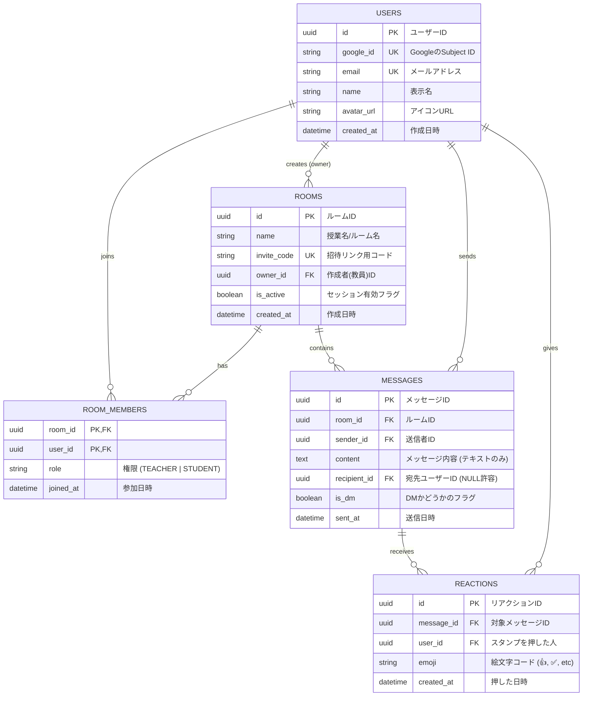

```mermaid
erDiagram
    %% ユーザー (Google認証で作成)
    USERS {
        uuid id PK "ユーザーID"
        string google_id UK "GoogleのSubject ID"
        string email UK "メールアドレス"
        string name "表示名"
        string avatar_url "アイコンURL"
        datetime created_at "作成日時"
    }

    %% チャットルーム (1授業 = 1ルーム)
    ROOMS {
        uuid id PK "ルームID"
        string name "授業名/ルーム名"
        string invite_code UK "招待リンク用コード"
        uuid owner_id FK "作成者(教員)ID"
        boolean is_active "セッション有効フラグ"
        datetime created_at "作成日時"
    }

    %% ルーム参加状況 (User <-> Room の多対多)
    ROOM_MEMBERS {
        uuid room_id PK, FK
        uuid user_id PK, FK
        string role "権限 (TEACHER | STUDENT)"
        datetime joined_at "参加日時"
    }

    %% メッセージ
    MESSAGES {
        uuid id PK "メッセージID"
        uuid room_id FK "ルームID"
        uuid sender_id FK "送信者ID"
        text content "メッセージ内容 (テキストのみ)"
        %% DM用: NULLなら全体チャット, IDが入っていればその人(または教員グループ)宛
        uuid recipient_id FK "宛先ユーザーID (NULL許容)" 
        boolean is_dm "DMかどうかのフラグ"
        datetime sent_at "送信日時"
    }

    %% スタンプ/リアクション
    REACTIONS {
        uuid id PK "リアクションID"
        uuid message_id FK "対象メッセージID"
        uuid user_id FK "スタンプを押した人"
        string emoji "絵文字コード (👍, ✅, etc)"
        datetime created_at "押した日時"
    }

    %% リレーション定義
    USERS ||--o{ ROOMS : "creates (owner)"
    USERS ||--o{ ROOM_MEMBERS : "joins"
    ROOMS ||--o{ ROOM_MEMBERS : "has"
    
    ROOMS ||--o{ MESSAGES : "contains"
    USERS ||--o{ MESSAGES : "sends"
    
    MESSAGES ||--o{ REACTIONS : "receives"
    USERS ||--o{ REACTIONS : "gives"
```