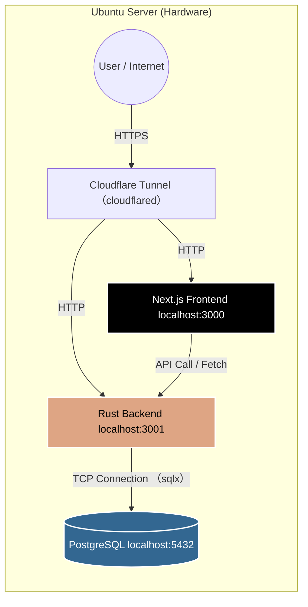

```mermaid
graph TD
    subgraph "Ubuntu Server (Hardware)"
        direction TB
        
        %% 外部からの入り口
        CF[Cloudflare Tunnel （cloudflared）]

        %% アプリケーション層
        Next[Next.js Frontend localhost:3000]
        Rust[Rust Backend localhost:3001]
        
        %% データ層
        DB[(PostgreSQL localhost:5432)]
        
        %% 接続関係
        Internet((User / Internet)) -->|HTTPS| CF
        CF -->|HTTP| Next
        CF -->|HTTP| Rust
        
        Next -->|API Call / Fetch| Rust
        Rust -->|TCP Connection （sqlx）| DB
    end
    
    style DB fill:#336791,stroke:#fff,stroke-width:2px,color:#fff
    style Rust fill:#DEA584,stroke:#fff,stroke-width:2px,color:#000
    style Next fill:#000000,stroke:#fff,stroke-width:2px,color:#fff
```