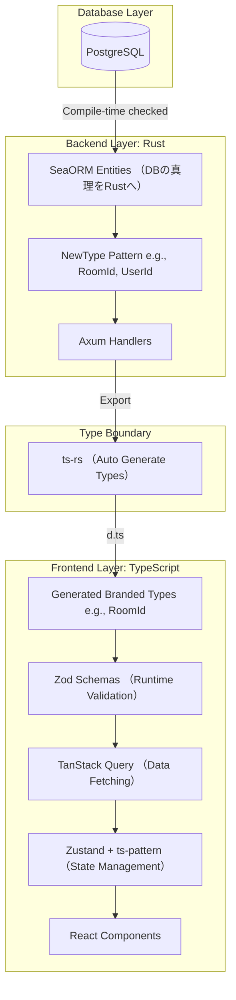

# AXON Coding Standards: The Type-Safe Fortress 🏰

本ドキュメントは、AXONプロジェクトにおける「型安全の極致」と「単一の信頼できる情報源（SSOT）」を達成するためのコーディング規約である。
我々の目標は「コンパイルが通れば、実行時エラーは論理的に存在し得ない」という状態を作り出すことだ。

## 🚫 絶対的ルール： `any` の禁止

TypeScriptにおける `any` の使用は **「大罪」** であり、いかなる理由があってもコミットしてはならない。
外部からの不明なデータや、型が確定しない場合は必ず `unknown` を使用し、後述する `Zod` を用いて実行時に安全にパース（検証）すること。

---

## 🏗️ 全体アーキテクチャと SSOT の流れ

データベース、バックエンド、フロントエンドの3層を貫く型安全のバトンリレーを以下のように定義する。



---

## 🦀 1. バックエンドの型安全 (Rust)

Rustの強力な型システムを最大限に活用し、「不正な状態を表現不可能にする」設計を行う。

### 1.1. NewType パターンの徹底

プリミティブ型（ `String` や `Uuid` ）をそのままビジネスロジックに持ち込まない。IDや特定の意味を持つ値は必ずラップする。

```rust
// ❌ Bad: プリミティブの乱用（引数の順番を間違えてもコンパイルが通ってしまう）
fn create_message(room_id: Uuid, user_id: Uuid) {}

// ✅ Good: NewTypeパターンによるコンパイラレベルの防壁
#[derive(Debug, Clone, Serialize, Deserialize, TS)]
#[ts(export)]
pub struct RoomId(pub Uuid);

#[derive(Debug, Clone, Serialize, Deserialize, TS)]
#[ts(export)]
pub struct UserId(pub Uuid);

fn create_message(room_id: RoomId, user_id: UserId) {}

```

### 1.2. SeaORM によるエンティティ駆動開発

SQLの生書きによるタイポや型ミスマッチを防ぐため、DB操作は `SeaORM` を用いる。DBのテーブル定義とRustのEntityを同期させ、クエリ構築時の型安全性を担保する。

### 1.3. エラーハンドリングの網羅性

`unwrap()` や `expect()` の使用はプロトタイプ実装時のみに留め、本番コードでは必ず `Result<T, E>` を返し、呼び出し元で `match` または `?` 演算子を用いて全てのエラーパターンをハンドリングすること。

---

## 🌐 2. TS-Rust-DB間の型安全 (Type Boundary)

フロントエンドとバックエンドの境界線は、最もバグが生まれやすい危険地帯である。ここを自動生成で完全に塞ぐ。

### 2.1. `ts-rs` による型の自動輸出

Rust側で定義された構造体（リクエスト/レスポンスDTOやNewType）には必ず `#[derive(TS)]` を付与し、TypeScriptの型定義ファイル（ `.d.ts` ）として出力する。
手動でTypeScriptのインターフェースを記述することは **「禁止」** とする。

### 2.2. Branded Types の活用

RustのNewTypeをTypeScript側でも名目的型付け（Nominal Typing）として扱うため、 `ts-rs` の出力設定を調整し、TypeScript側では **「Branded Types」** として扱う。これにより、TS側でも `RoomId` と `UserId` の取り違えがコンパイルエラーとなる。

---

## 🟦 3. フロントエンドの型安全 (TypeScript)

ブラウザ上で動くコードは、常に「外部からの不確実なデータ」に晒されている前提で防御的プログラミングを行う。

### 3.1. Zod による「水際対策」

外部（APIやフォーム入力）から受け取るデータは、必ず `Zod` スキーマを通過させる。パースに成功したデータのみを、アプリケーション内部の信頼できるデータとして扱う。

```typescript
// Zodスキーマを通して初めて、安全な型としてアプリ内に迎え入れる
const RoomResponseSchema = z.object({
  id: z.string().uuid().transform(val => val as RoomId), // Branded Typeへの変換
  name: z.string().min(1),
});

```

### 3.2. TanStack Query による宣言的データフェッチ

`useEffect` を用いた手動のフェッチやローディング状態の管理は行わない。サーバー状態（Server State）の管理はすべて `TanStack Query` に委譲し、クエリキーと返り値の型を厳格に紐付ける。

### 3.3. Zustand + `ts-pattern` による状態管理

クライアント状態（Client State）は `Zustand` で管理する。その際、状態遷移や条件分岐には `ts-pattern` を使用し、**Exhaustive Check（網羅性チェック）** をコンパイラに強制させる。

```typescript
// ✅ Good: ts-pattern による網羅的な状態ハンドリング。新しい状態が増えればコンパイルエラーになる。
match(queryState)
  .with({ status: 'pending' }, () => <Loading />)
  .with({ status: 'error' }, (e) => <ErrorBox error={e} />)
  .with({ status: 'success' }, (data) => <RoomList rooms={data} />)
  .exhaustive(); // 全パターン網羅していないとエラー！

```

---

## 💡 見落とされがちな落とし穴 (Pitfalls)

1. **自動生成への過信:** `ts-rs` はRustコードからTS型を生成するが、もし「RustのEntity」と「実際のDBスキーマ」がズレていれば、生成された型も嘘をつくことになる。マイグレーション実行とEntityの更新は必ずセットで行うこと。
2. **Branded Types の境界:** 外部ライブラリ（例えばルーティングライブラリのパスパラメータ抽出）から取得したただの文字列を、そのまま Branded Type の変数に代入することはできない。必ず Zod を通して `as RoomId` のように「ブランドを付与（Minting）」するバリデーション層を挟む必要がある。

