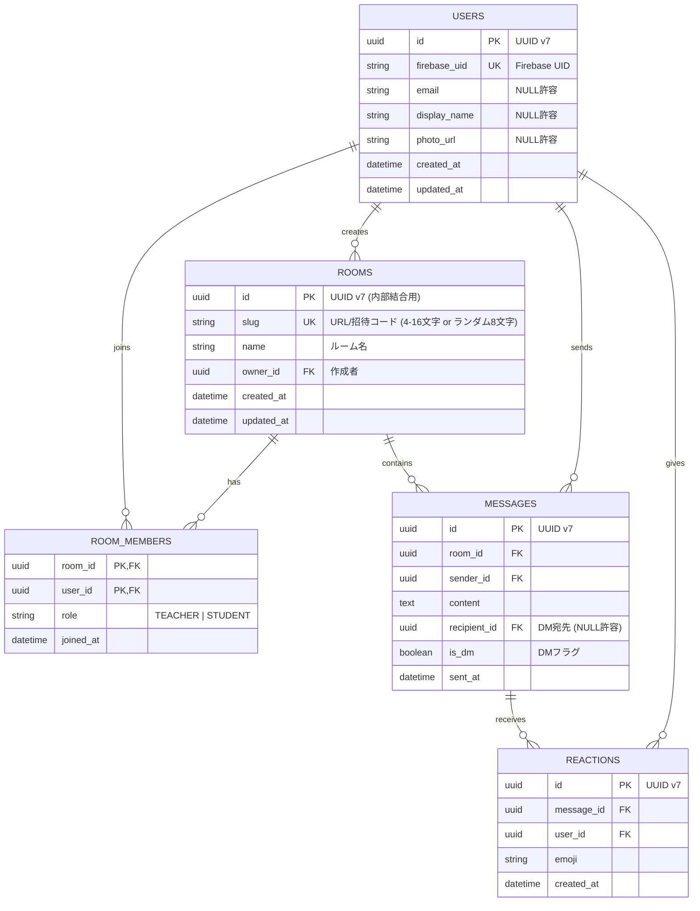

```mermaid
erDiagram
    %% ユーザー (Firebase Auth連携)
    USERS {
        uuid id PK "UUID v7"
        string firebase_uid UK "Firebase UID"
        string email "NULL許容"
        string display_name "NULL許容"
        string photo_url "NULL許容"
        datetime created_at
        datetime updated_at
    }

    %% チャットルーム (Slug = 招待ID)
    ROOMS {
        uuid id PK "UUID v7 (内部結合用)"
        string slug UK "URL/招待コード (4-16文字 or ランダム8文字)"
        string name "ルーム名"
        uuid owner_id FK "作成者"
        datetime created_at
        datetime updated_at
    }

    %% ルームメンバー
    ROOM_MEMBERS {
        uuid room_id PK, FK
        uuid user_id PK, FK
        string role "TEACHER | STUDENT"
        datetime joined_at
    }

    %% メッセージ
    MESSAGES {
        uuid id PK "UUID v7"
        uuid room_id FK
        uuid sender_id FK
        text content
        uuid recipient_id FK "DM宛先 (NULL許容)"
        boolean is_dm "DMフラグ"
        datetime sent_at
    }

    %% リアクション
    REACTIONS {
        uuid id PK "UUID v7"
        uuid message_id FK
        uuid user_id FK
        string emoji
        datetime created_at
    }

    USERS ||--o{ ROOMS : "creates"
    USERS ||--o{ ROOM_MEMBERS : "joins"
    ROOMS ||--o{ ROOM_MEMBERS : "has"
    ROOMS ||--o{ MESSAGES : "contains"
    USERS ||--o{ MESSAGES : "sends"
    MESSAGES ||--o{ REACTIONS : "receives"
    USERS ||--o{ REACTIONS : "gives"
```