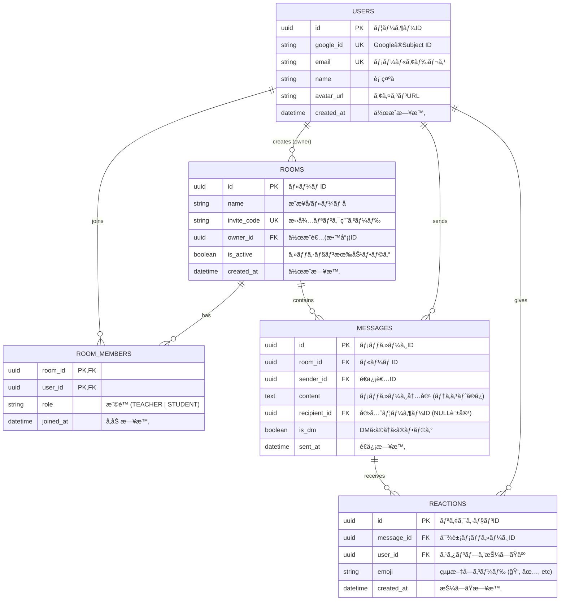

```mermaid
erDiagram
    %% ユーザー (Googleèªè¨¼ã§ä½œæˆ)
    USERS {
        uuid id PK "ユーザーID"
        string google_id UK "Googleã®Subject ID"
        string email UK "メールアドレス"
        string name "表示å"
        string avatar_url "アイコンURL"
        datetime created_at "作æˆæ—¥æ™‚"
    }

    %% ãƒãƒ£ãƒƒãƒˆãƒ«ãƒ¼ãƒ  (1æˆæ¥­ = 1ルーム)
    ROOMS {
        uuid id PK "ルームID"
        string name "æˆæ¥­å/ルームå"
        string invite_code UK "招待リンク用コード"
        uuid owner_id FK "作æˆè€…(教員)ID"
        boolean is_active "セッション有効フラグ"
        datetime created_at "作æˆæ—¥æ™‚"
    }

    %% ルームå‚åŠ çŠ¶æ³ (User <-> Room ã®å¤šå¯¾å¤š)
    ROOM_MEMBERS {
        uuid room_id PK, FK
        uuid user_id PK, FK
        string role "æ¨©é™ (TEACHER | STUDENT)"
        datetime joined_at "å‚加日時"
    }

    %% メッセージ
    MESSAGES {
        uuid id PK "メッセージID"
        uuid room_id FK "ルームID"
        uuid sender_id FK "é€ä¿¡è€…ID"
        text content "メッセージ内容 (テキストã®ã¿)"
        %% DM用: NULLãªã‚‰å…¨ä½“ãƒãƒ£ãƒƒãƒˆ, IDãŒå…¥ã£ã¦ã„ã‚Œã°ãã®äºº(ã¾ãŸã¯æ•™å“¡ã‚°ãƒ«ãƒ¼ãƒ—)å®›
        uuid recipient_id FK "宛先ユーザーID (NULL許容)" 
        boolean is_dm "DMã‹ã©ã†ã‹ã®ãƒ•ãƒ©ã‚°"
        datetime sent_at "é€ä¿¡æ—¥æ™‚"
    }

    %% スタンプ/リアクション
    REACTIONS {
        uuid id PK "リアクションID"
        uuid message_id FK "対象メッセージID"
        uuid user_id FK "スタンプを押ã—ãŸäºº"
        string emoji "絵文字コード (ğŸ‘, ✅, etc)"
        datetime created_at "押ã—ãŸæ—¥æ™‚"
    }

    %% リレーション定義
    USERS ||--o{ ROOMS : "creates (owner)"
    USERS ||--o{ ROOM_MEMBERS : "joins"
    ROOMS ||--o{ ROOM_MEMBERS : "has"
    
    ROOMS ||--o{ MESSAGES : "contains"
    USERS ||--o{ MESSAGES : "sends"
    
    MESSAGES ||--o{ REACTIONS : "receives"
    USERS ||--o{ REACTIONS : "gives"
```